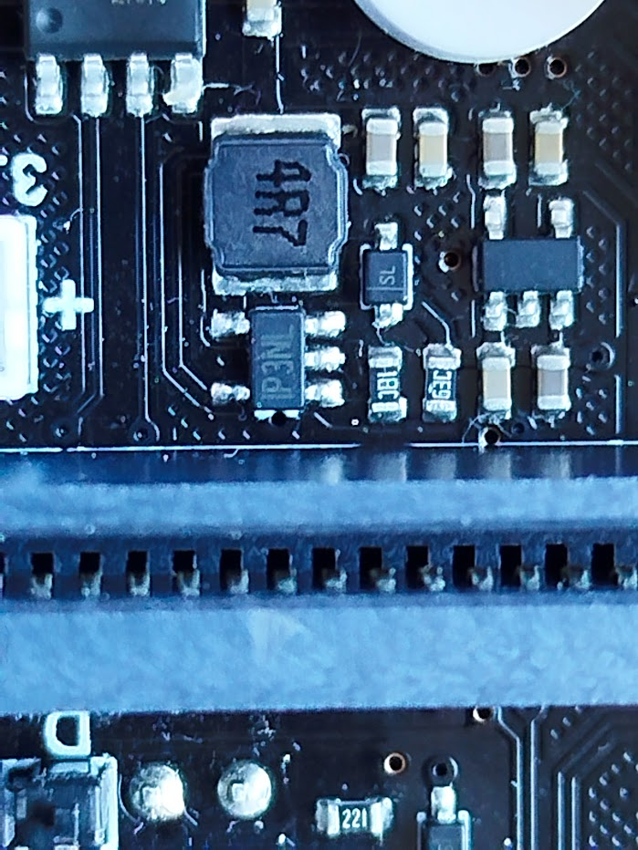
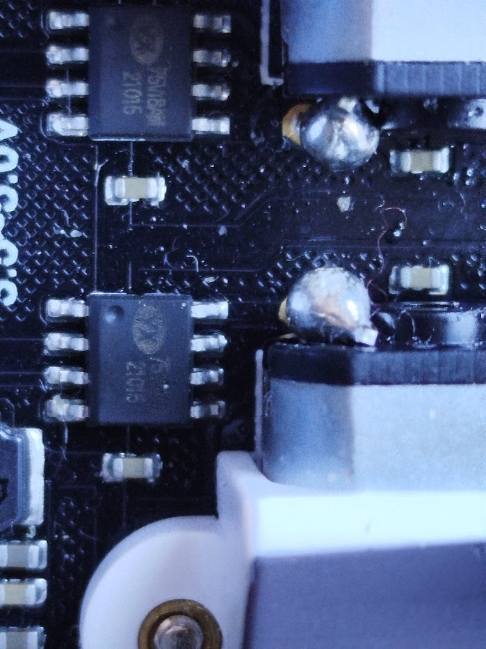
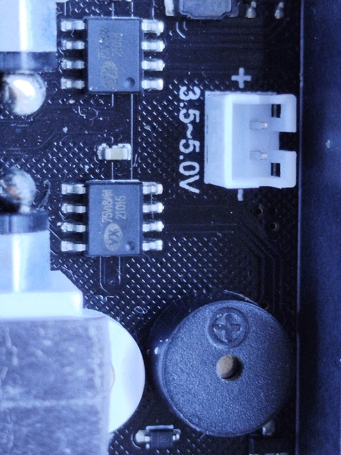
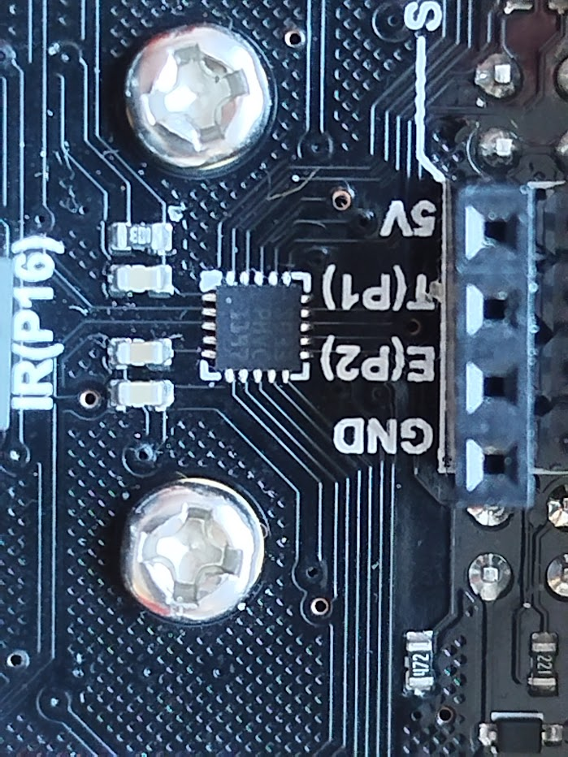

## Maqueen

[Maqueen Lite](https://www.dfrobot.com/product-1783.html)

### Especificaciones

1. **2 x Sensores digitales por Infrarrojo** (siguelíneas).
2. **Zumbador**
3. **Receptor Infrarrojo** (Decodificador NEC).
4. **2x LEDs** (Control de nivel analógico).
5. **4x LEDs RGB** (16 millones de colores).
6. **Conector Sensor Ultrasónico SR04, SR04P** (5V).
7. **Conector I2C** (5V): 1 unidad.
8. **2x Conectores de Servo S1 y S2**
9. **3x Conectores de Extensión** (P0, P1, P2).
10. **Conectores de micro:bit**
- **2x Motores de Engranajes Metálicos N20**  con velocidad y dirección regulable por PWM.
- **6x Soportes y Agujeros para Tornillos M3 de Extensión con Cubierta Protectora**.
- **Voltaje de Alimentación**: 5V CC (Tres baterías AAA).
- **Método de Programación**: Programación gráfica Makecode o código (Python o JavaScript).
- **Dimensiones**: 81 mm x 85 mm x 44 mm / 3.19 x 3.35 x 1.73 pulgadas.
- **Peso**: 75.55 g.

### Recursos

[Tutorial micro:bit y maqueen](https://sites.google.com/iessanjeronimo.es/tecnositesanjeronimo/3%C2%BA-e-s-o-computaci%C3%B3n-y-rob%C3%B3tica/unidad-4-introducci%C3%B3n-a-microbit-placa-y-robot-maqueen)
[DFRobot tutorial (english)](https://wiki.dfrobot.com/micro_Maqueen_Lite_for_micro_bit_SKU_ROB0148-EN-L) & [other](https://wiki.dfrobot.com/micro_Maqueen_for_micro_bit_SKU_ROB0148-EN)
[Silly maqueen by DFRobot](https://github.com/DFRobot/Silly-Maqueen-Tutorial-Makecode/blob/master/Silly%20Maqueen%20Tutorial-MakeCode-New.pdf)

### Detalles técnicos
[Technical details](https://macsbug.wordpress.com/2021/12/)

[Programming the STM8S103F](https://tenbaht.github.io/sduino/api/I2C/)

