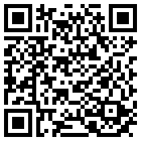
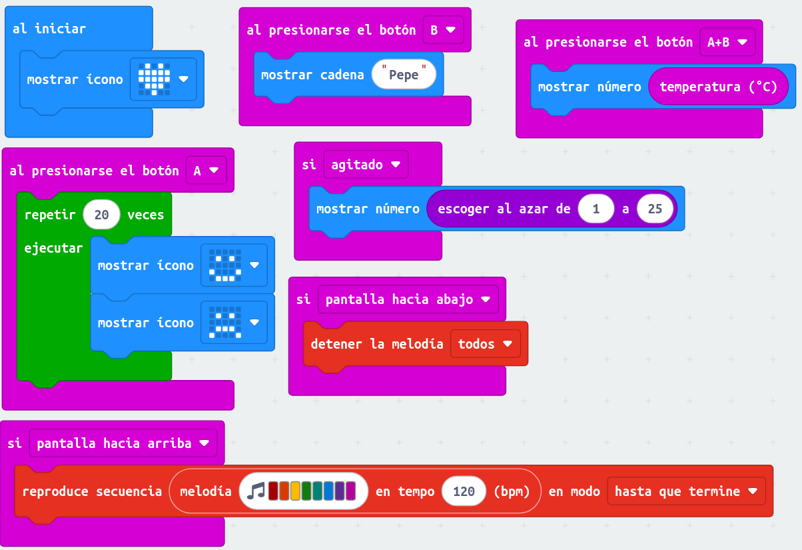
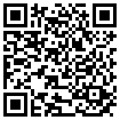
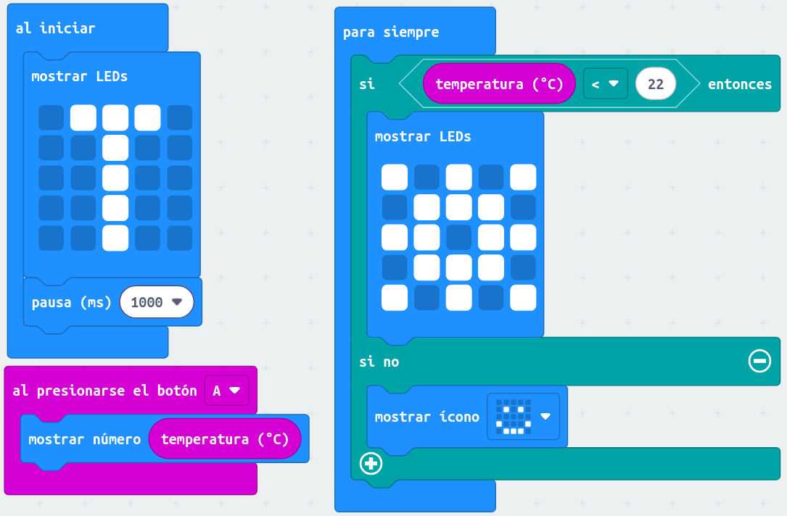
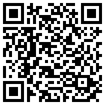
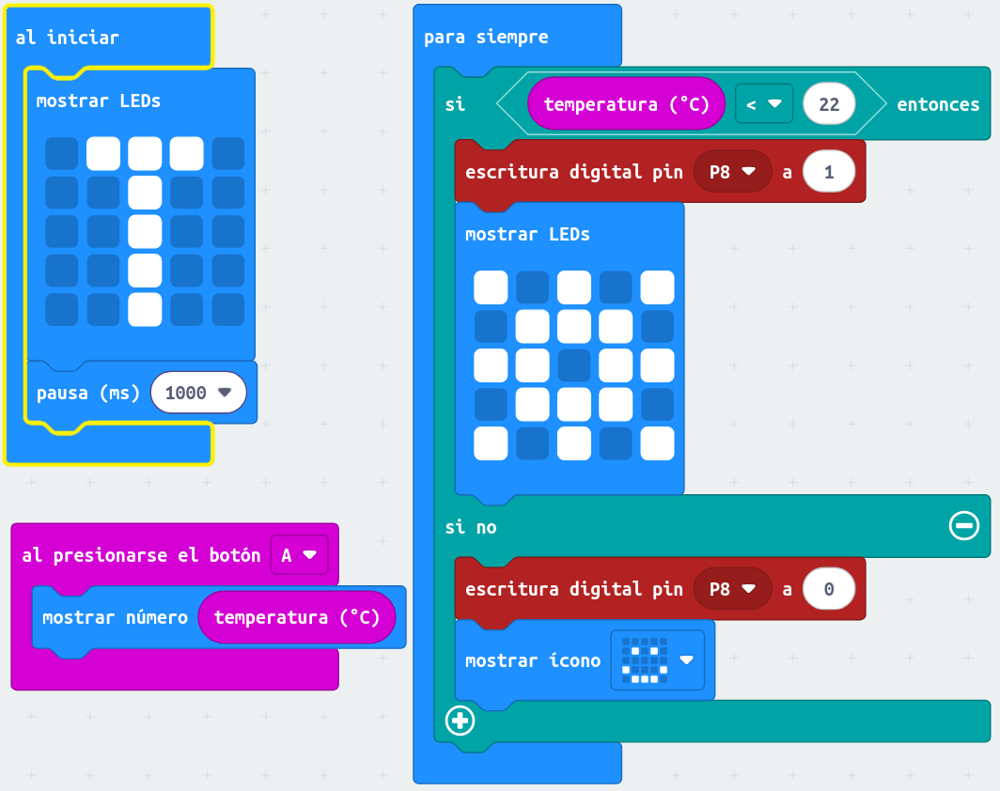
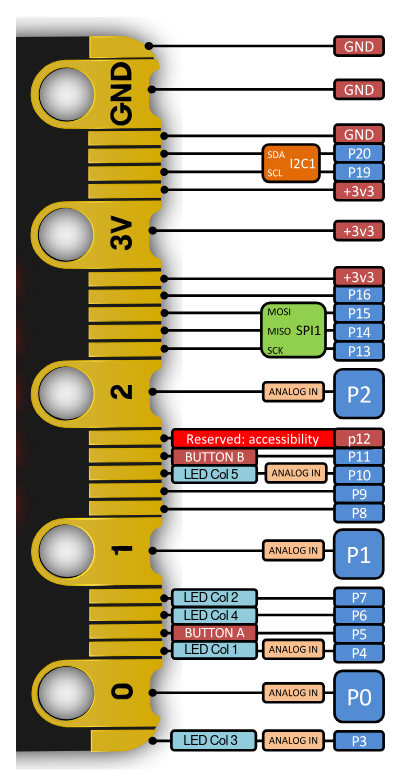

# Robótica II - Sesión 1 

[Documentación microbit](https://tech.microbit.org/)

### Repaso

[Programa repaso](https://makecode.microbit.org/S89959-36298-48094-05368)

### Termostato v0

[Programa termostato v0](https://makecode.microbit.org/S10198-22052-63880-55740)

### Termostato v1

[Programa termostato v1](https://makecode.microbit.org/S29325-64524-27271-16035)

[Documentación sobre el conector/pines micro:bit](https://tech.microbit.org/hardware/edgeconnector/)

